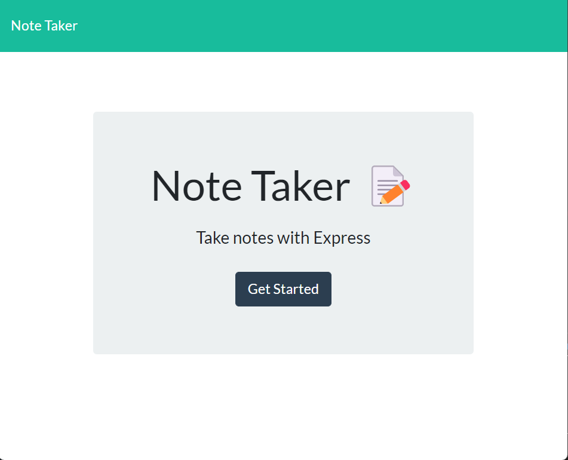
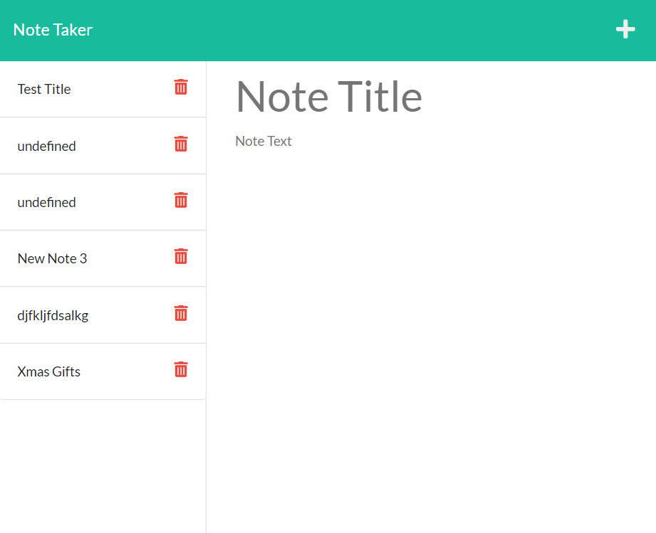
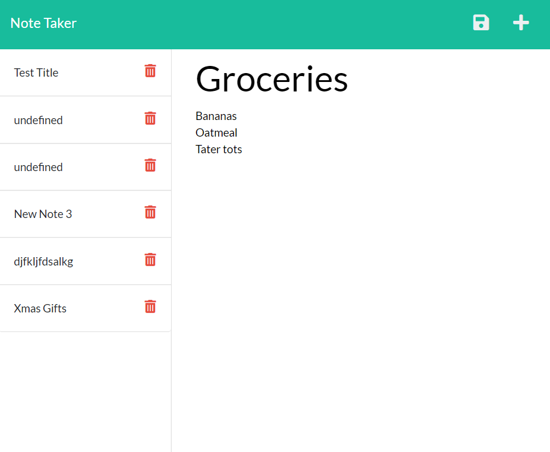

# Note Taker

## Description
This  web app is meant to be a place users can write and save notes to themselves in order to keep track of to-dos, thoughts, appointments, etc. They can write and save notes, and view the notes they've made. Organization is key! This app is intended to assist with that.

## Table of Contents

- [Installation](#installation)
- [Usage](#usage)
- [Credits](#credits)
- [License](#license)
- [Tests](#tests)
- [Questions](#questions)

## Installation
Users need only navigate to the website.

## Usage
On the homepage, users click the "Get Started" button to be taken to the note form. 

They enter the title of their note and its contents, and then will have the option to save the note via a floppy disc icon that appears in the top right corner. 

They can click on saved notes in the sidebar to view them, and click the plus sign to create a new note.

The app can be viewed live [here](https://gentle-reaches-39186.herokuapp.com/)

## Credits
This was created from starter code provided by the bootcamp course.

## License
No license.
    

## Tests
No tests.

## Questions
If you have any questions, you can reach me [here](mailto:ea.wiggans@gmail.com)

You can view my GitHub profile and repository [here](https://github.com/eawiggans)

